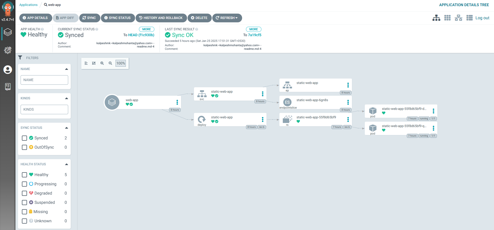
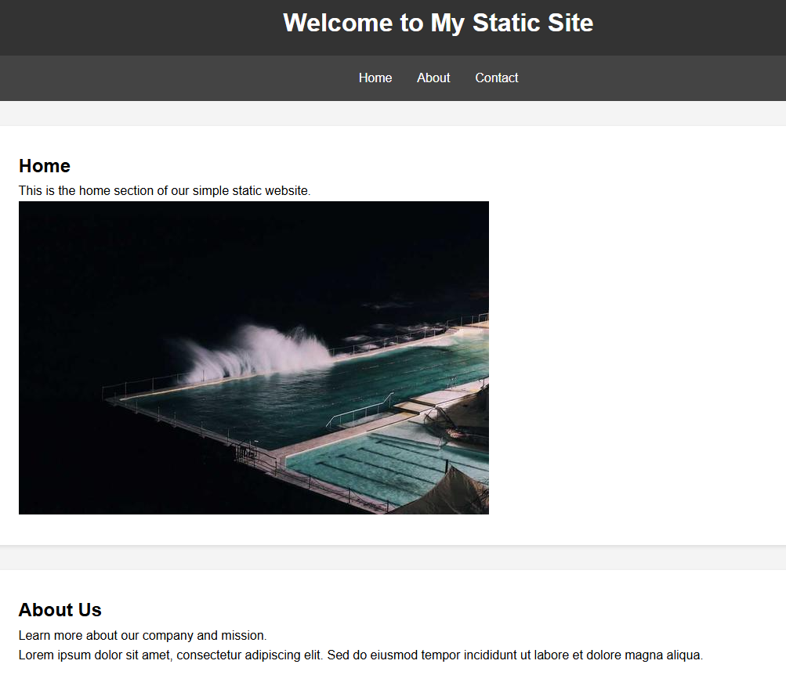
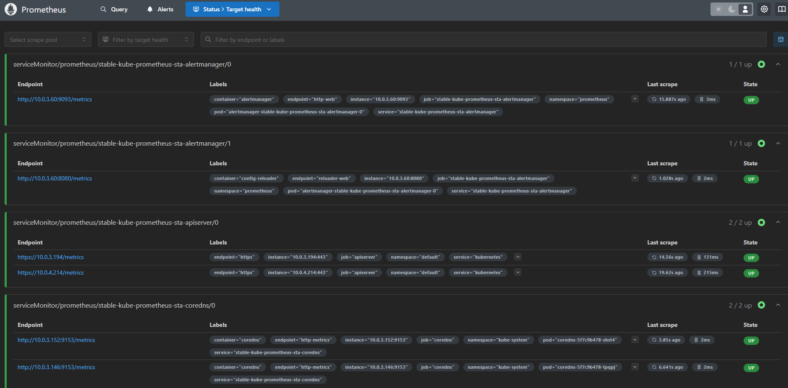
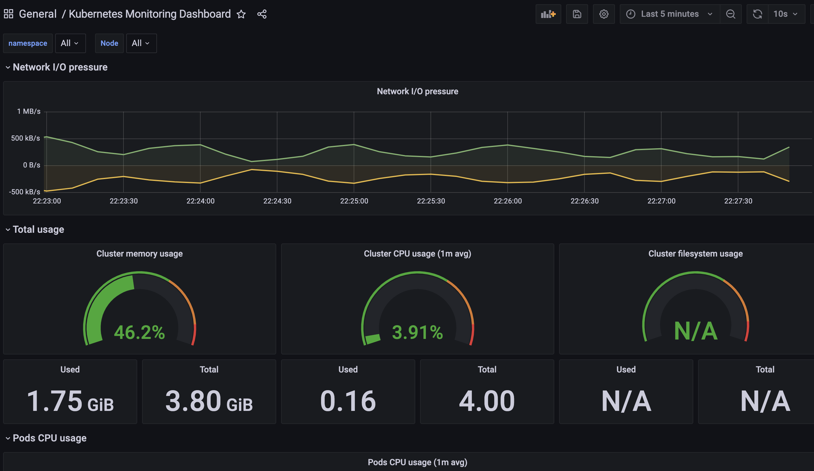

# Project Setup and Deployment Guide

This guide provides step-by-step instructions for setting up and deploying the application using Docker, Jenkins, SonarQube, Trivy, prometheus, grafana and Kubernetes.

## Phase 1: Create Infrastructure using Terraform
- Use `aws configure` to set up aws credentials for terraform
- [AWS CLI Installation](https://docs.aws.amazon.com/cli/latest/userguide/getting-started-install.html)
1. **Create jenkins server**
    - Create jenkins server and its all components using terraform
2. **Create Bastion-EKS Cluster**
    - Create EKS cluster and its all components using terraform
3. **Command**
    - `terraform init` to initialize terraform
    - `terraform validate` to validate the configuration
    - `terraform plan` to generate a plan
    - `terraform apply` to apply the plan

## Phase 2: Docker Setup in Jenkins-server
- `ssh -i <key-file> ec2-user@<jenkinsServer-ip>` to access Jenkins server
### Step: Install Docker on Jenkins Server

1. **Set up Docker on the Jenkins instance:**

    ```bash
    sudo apt-get update
    sudo apt-get install docker.io -y
    sudo usermod -aG docker $USER  # Add system user to docker group
    newgrp docker
    sudo chmod 777 /var/run/docker.sock # Add permissions to docker socket
    ```

2. **Ensure Docker Service Starts on Boot:**

    ```bash
    # Enabled by default, but you can verify
    systemctl is-enabled docker

    # If it’s not enabled, enable it with:
    sudo systemctl enable docker
    ```

## Phase 3: Security in Jenkins-server

### Step: Install SonarQube and Trivy

1. **Install SonarQube:**

    ```bash
    docker run -d --name sonar -p 9000:9000 sonarqube:lts-community
    ```

    - To access:
        `publicIP:9000` (default username & password: `admin`)
    
    - Chnage Inbound Rules:
        - Open port 9000 for inbound traffic

2. **Set the Docker Container Restart Policy for SonarQube:**

    ```bash
    # Use when creating the container:
    docker run -d --restart unless-stopped <image_name>

    # Use when updating an existing container:
    docker update --restart unless-stopped <container_name_or_id>
    ```

3. **Install Trivy:**

    ```bash
    sudo apt-get install wget apt-transport-https gnupg lsb-release
    wget -qO - https://aquasecurity.github.io/trivy-repo/deb/public.key | sudo apt-key add -
    echo deb https://aquasecurity.github.io/trivy-repo/deb $(lsb_release -sc) main | sudo tee -a /etc/apt/sources.list.d/trivy.list
    sudo apt-get update
    sudo apt-get install trivy
    ```

4. **Scan Images and Directories Using Trivy:**

    ```bash
    # To scan an image:
    trivy image <imageid>

    # To scan the present directory:
    trivy fs .
    ```

### Step: Integrate SonarQube and Configure

1. **Integrate SonarQube with your CI/CD pipeline.**
2. **Configure SonarQube to analyze code for quality and security issues.**

## Phase 4: CI/CD Setup

### Step: Install Jenkins for Automation

1. **Install Jenkins on the Jenkins EC2 instance to automate deployment:**

    **Jenkins Prerequisite: Install Java**

    ```bash
    sudo apt update
    sudo apt install fontconfig openjdk-17-jre
    java -version
    ```

    **Install Jenkins:**

    ```bash
    sudo wget -O /usr/share/keyrings/jenkins-keyring.asc \
    https://pkg.jenkins.io/debian-stable/jenkins.io-2023.key
    echo deb [signed-by=/usr/share/keyrings/jenkins-keyring.asc] \
    https://pkg.jenkins.io/debian-stable binary/ | sudo tee \
    /etc/apt/sources.list.d/jenkins.list > /dev/null
    sudo apt-get update
    sudo apt-get install jenkins
    sudo systemctl start jenkins
    sudo systemctl enable jenkins
    ```

    - Access Jenkins in a web browser using the public IP of your EC2 instance:

      `publicIp:8080`

    ---
    Chnage Inbound Rules:
    - Open port 8080 for inbound traffic

### Step: Install Necessary Plugins in Jenkins

1. Go to **Manage Jenkins** → **Plugins** → **Available Plugins** and install the following plugins:
    - SonarQube Scanner (Install without restart)
    - Pipeline View

### Step: Configure SonarQube in Jenkins

1. **Create the SonarQube Token:**

    - Go to **Jenkins Dashboard** → **Manage Jenkins** → **Credentials** → **Add Secret Text**.
    - After adding the SonarQube token, click on **Apply** and **Save**.

2. **Configure System and Global Tool Configuration:**

    - Use the **Configure System** option in Jenkins to configure different servers.
    - Use the **Global Tool Configuration** to configure different tools installed using plugins.
    - Install the SonarQube scanner in the tools.

3. **Create a Jenkins Webhook:**

    - Go to your GitHub repository settings → **Webhooks** → **Add webhook**.
    - Set the **Payload URL** to `http://<jenkins-url>/github-webhook/` (replace `<jenkins-url>` with your Jenkins server URL).
    - Set the **Content type** to `application/json`.
    - Choose the events you want to trigger the webhook (e.g., **Push events**).
    - Save the webhook.

### Step: Install Docker Tools and Docker Plugins

1. Go to **Dashboard** in your Jenkins web interface.
2. Navigate to **Manage Jenkins** → **Manage Plugins**.
3. Click on the **Available** tab and search for **Docker**.
4. Check the following Docker-related plugins:
    - Docker
    - Docker Commons
    - Docker Pipeline
    - Docker API
    - docker-build-step
5. Click on the **Install without restart** button to install these plugins.

### Step: Add DockerHub Credentials

1. Go to **Dashboard** → **Manage Jenkins** → **Manage Credentials**.
2. Click on **System** and then **Global credentials (unrestricted)**.
3. Click on **Add Credentials** on the left side.
4. Choose **Secret text** as the kind of credentials.
5. Enter your DockerHub credentials (Username and Password) and give the credentials an ID (e.g., "docker").
6. Click **OK** to save your DockerHub credentials.

### Step: Grant Rights for Jenkins Service to Execute Docker Commands

```bash
sudo su
sudo usermod -aG docker jenkins # Adds the Jenkins user to the Docker group
sudo systemctl restart jenkins  # Restart Jenkins Server
```

### Step: Run Jenkins Pipeline

1. Run pipleine with `Jenkinsfile` from codebase.
2. Run with `github webhook trigger` which automatically triggered form github webhook

### DockerHub (Container Image Repo)
[DockerHub](https://hub.docker.com/r/kalpeshmohanta/app-image/tags).

## Phase 4: Kubernetes Setup

### Prerequisite
- `ssh -i <key-file> ec2-user@<bastion-ip>` to access EKS cluster from bastion server
- Use `aws configure` to set up aws credentials
- Install `unzip`, `kubectl`, `helm` and `aws cli` on the bastion server to access the EKS cluster securely.
- Install `kubectl` from the [Official Documentation](https://kubernetes.io/docs/tasks/tools/).

### Set Up: `kubeconfig`
- The `kubeconfig` file contains the connection details and credentials for your Kubernetes cluster. This file is typically located at `~/.kube/config`.

- **Cloud-based Cluster (EKS):**

    ```bash
    aws eks update-kubeconfig --region <region> --name <cluster-name>
    ```

### Deploy Application with ArgoCD

1. **Install ArgoCD:**

   You can install ArgoCD on your Kubernetes cluster by following the instructions provided in the [EKS Workshop](https://archive.eksworkshop.com/intermediate/290_argocd/install/) documentation.

2. **Set Your GitHub Repository as a Source:**

   After installing ArgoCD, you need to set up your GitHub repository as a source for your application deployment. This typically involves configuring the connection to your repository and defining the source for your ArgoCD application. The specific steps will depend on your setup and requirements.

3. **Create an ArgoCD Application:**

    - `name`: Set the name for your application.
    - `destination`: Define the destination where your application should be deployed.
    - `project`: Specify the project the application belongs to.
    - `source`: Set the source of your application, including the GitHub repository URL, revision, and the path to the application within the repository.
    - `syncPolicy`: Configure the sync policy, including automatic syncing, pruning, and self-healing.

    

4. **Access your Application:**

   - Access the static-app through the LoadBalancer address `kubectl get svc -n app`

    

### Prometheus and Grafana
1. **Using helm(package manager) to install Prometheus Operator including Grafana**
    - Add the Helm Stable Charts for your local client. Execute the below command
        ```bash
        helm repo add stable https://charts.helm.sh/stable
        ```
    - Create Prometheus namespace
        ```bash
        kubectl create namespace prometheus
        ```
    - Install kube-prometheus-stack
        ```bash
        helm install stable prometheus-community/kube-prometheus-stack -n prometheus #helm repo kube-stack-prometheus (formerly prometheus-operator) comes with a grafana deployment embedded.
        ```
    - check if prometheus and grafana pods are running already
        ```bash
        kubectl get pods -n prometheus
        kubectl get svc -n prometheus # to check the service
        ```
    - In order to make prometheus and grafana available outside the cluster, use LoadBalancer
        ```bash
        kubectl edit svc stable-kube-prometheus-sta-prometheus -n prometheus # Edit Prometheus Service
        kubectl edit svc stable-grafana -n prometheus # Edit Grafana Service
        ```
    - Verify if service is changed to LoadBalancer and also to get the Load Balancer URL.
        ```bash
        kubectl get svc -n prometheus
        ```
2. **Access Prometheus & Grafana UI in the browser using the LoadBalancer URL from svc**
    - Get Secrets in prometheus namespace for Grafana password
        ```bash
        kubectl get secret -n prometheus stable-grafana -o jsonpath="{.data.admin-password}" | base64 --decode ; echo
        ```
    - Grafana `UserName: admin` & `Password: prom-operator`
    - Access the prometheus UI using the LoadBalancer URL from svc with port `9090`

    

    - Access the grafana UI using the LoadBalancer URL from svc
    - creating a dashboard to monitor the cluster
        - Click '+' button on left panel and select ‘Import’.
        - Enter 12740 dashboard id under Grafana.com Dashboard.
        - Click ‘Load’.
        - Select ‘Prometheus’ as the endpoint under prometheus data sources drop down.
        - Click ‘Import’.
        - After that it will show monitoring dashboard for all cluster nodes

    
## Phase 6: Cleanup

### Step: Cleanup AWS EC2 Instances

- Terminate AWS EC2 instances,EKS and all other resources that are no longer needed with `terraform destroy`.
